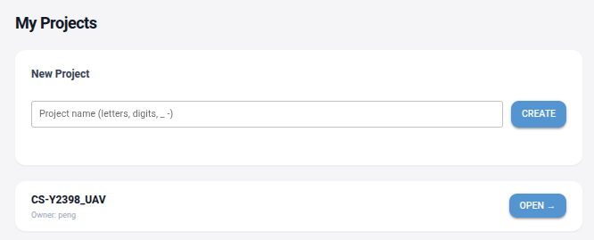
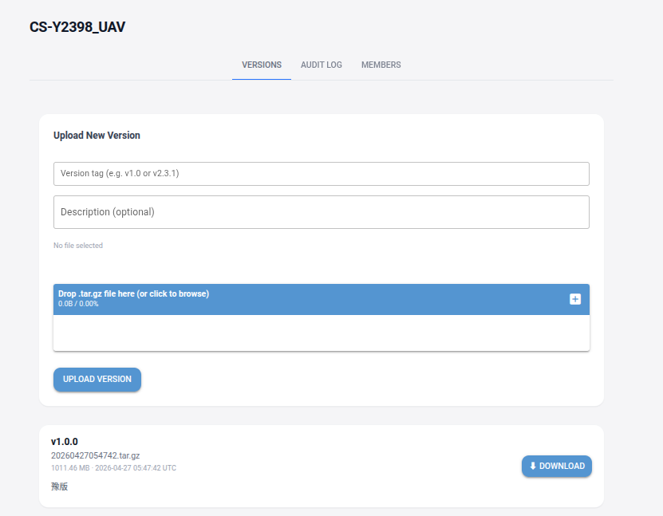

# MyBagHub

轻量级文件包管理与分发平台。前后端完全独立部署，用户在浏览器中动态选择要连接的后端节点。





---

## 架构概述

```
┌─────────────────────────────────────────────────────────┐
│                    用户浏览器                             │
│                                                          │
│  ① 输入后端 IP:Port → GET /health 验证                   │
│  ② 验证通过 → 登录 / 注册                                │
│  ③ 业务操作（项目、版本、成员管理）                       │
└──────────────┬──────────────────────────────────────────┘
               │ HTTP/REST (动态地址，存储于浏览器 Session)
       ┌───────┴──────────┐            ┌──────────────────┐
       │  Frontend 容器   │            │  Backend 容器    │
       │  NiceGUI + httpx │  ────────► │  FastAPI + uvicorn│
       │  Port : 8080     │            │  Port : 8000     │
       └──────────────────┘            └────────┬─────────┘
                                                │
                                       ┌────────┴─────────┐
                                       │  宿主机 /data 目录 │
                                       │  (volume mount)   │
                                       └──────────────────┘
```

**前端与后端完全解耦**：

- 各自拥有独立的 `Dockerfile`、`requirements.txt`、`config.json`
- 前端启动时不依赖后端；后端 URL 由用户在 `/server` 页面输入并在浏览器 Session 中维护
- 后端提供 `/health` 接口，前端在进入登录页前先调用该接口验证服务可用性

**技术栈**：

| 模块      | 技术                                       |
| --------- | ------------------------------------------ |
| 后端 API  | FastAPI + uvicorn                          |
| 认证      | JWT (python-jose, HS256) + bcrypt 密码哈希 |
| 文件存储  | 本地文件系统（无数据库）                   |
| 文件锁    | portalocker（跨进程安全写入）              |
| 前端 UI   | NiceGUI（Python 驱动的 Vue/Quasar 页面）   |
| 前端 HTTP | httpx（异步请求）                          |

---

## 目录结构

```
library_core/
├── backend/
│   ├── Dockerfile          # 后端独立镜像
│   ├── requirements.txt    # 后端依赖（含版本锁定）
│   ├── config.json         # 后端默认配置（开发用）
│   ├── main.py             # FastAPI 入口
│   ├── config.py           # 配置加载器
│   ├── dependencies.py     # JWT 依赖注入
│   ├── schemas.py          # Pydantic 数据模型
│   ├── routers/            # auth / projects 路由
│   └── services/           # 业务逻辑层
├── frontend/
│   ├── Dockerfile          # 前端独立镜像
│   ├── requirements.txt    # 前端依赖
│   ├── config.json         # 前端默认配置（开发用）
│   ├── app.py              # NiceGUI 入口
│   ├── api.py              # HTTP 请求封装（动态后端 URL）
│   ├── auth.py             # Session 管理
│   ├── config.py           # 配置加载器（独立，不依赖后端）
│   ├── components/         # 公用 UI 组件
│   └── pages/              # 各页面模块
│       ├── server_select.py  # 服务器节点选择页（第一步）
│       ├── login.py
│       ├── register.py
│       ├── projects.py
│       └── project_detail/   # 项目详情（版本/日志/成员 Tab）
├── run_services.py         # 本地调试：同时启动前后端
└── data/                   # 本地开发数据目录（不提交）
```

---

## 快速开始

### 1. 构建镜像

**必须在项目根目录执行**（`-f` 指定 Dockerfile，`.` 为 build context）：

```bash
# 构建后端镜像
docker build -f backend/Dockerfile -t mybagbub-backend .

# 构建前端镜像
docker build -f frontend/Dockerfile -t mybagbub-frontend .
```

### 2. 准备配置文件

**后端配置** — 保存到宿主机任意目录，通过 volume 挂载进容器：

```json
{
  "STORAGE_ROOT": "/data",
  "MAX_FILE_SIZE": 5368709120,
  "JWT_SECRET": "请替换为随机长字符串",
  "JWT_ALGORITHM": "HS256",
  "JWT_EXPIRE_HOURS": 24,
  "BACKEND_HOST": "0.0.0.0",
  "BACKEND_PORT": 8000,
  "LOG_LEVEL": "INFO"
}
```

**前端配置**（可选，不配置则使用默认值）：

```json
{
  "FRONTEND_HOST": "0.0.0.0",
  "FRONTEND_PORT": 8080,
  "STORAGE_SECRET": "请替换为随机长字符串（用于 NiceGUI Session 加密）",
  "MAX_FILE_SIZE": 5368709120,
  "LOG_LEVEL": "INFO"
}
```

### 3. 创建容器

```bash
# 启动后端
docker run -d \
  --name mybagbub-backend \
  -p 8000:8000 \
  -v /your/host/config:/config \
  -v /your/host/data:/data \
  mybagbub-backend

# 启动前端
docker run -d \
  --name mybagbub-frontend \
  -p 8080:8080 \
  -v /your/host/frontend-config:/config \
  mybagbub-frontend
```

> **说明**：前后端容器完全独立，无需 `--link` 或同一 Docker network。
> 前端在运行时由用户在浏览器中指定后端地址。

### 4. 访问

1. 打开浏览器，访问 `http://<frontend-host>:8080`
2. 在**服务器节点选择页**输入后端 IP 和端口（如 `192.168.1.100:8000`）
3. 前端自动调用 `/health` 验证后端可用性
4. 验证通过后进入登录 / 注册页

---

## 后端 API 端点一览

| 方法   | 路径                                         | 说明                     |
| ------ | -------------------------------------------- | ------------------------ |
| GET    | `/health`                                  | 服务健康检查（无需认证） |
| POST   | `/auth/register`                           | 注册                     |
| POST   | `/auth/login`                              | 登录，返回 JWT           |
| GET    | `/projects`                                | 获取项目列表             |
| POST   | `/projects`                                | 创建项目                 |
| GET    | `/projects/{name}/versions`                | 获取版本列表             |
| POST   | `/projects/{name}/versions`                | 上传新版本               |
| GET    | `/projects/{name}/versions/{ver}/download` | 下载文件                 |
| GET    | `/projects/{name}/logs`                    | 审计日志                 |
| POST   | `/projects/{name}/members`                 | 添加成员（Owner）        |
| DELETE | `/projects/{name}/members/{user}`          | 移除成员（Owner）        |

---

## 本地开发（不使用 Docker）

```bash
# 安装依赖
python -m venv .venv
source .venv/bin/activate
pip install -r backend/requirements.txt -r frontend/requirements.txt

# 同时启动前后端（用于调试）
python run_services.py
```

访问 `http://localhost:8080`，服务器节点选择页输入 `localhost:8000`。

---

## 配置优先级

配置文件查找顺序（先找到先用）：

**后端**：

1. 环境变量 `MY_LIBRARY_CONFIG_PATH` 指向的文件
2. 容器内 `/config/config.json`（volume 挂载）
3. `backend/config.json`（本地开发）

**前端**：

1. 环境变量 `MY_LIBRARY_FRONTEND_CONFIG_PATH` 指向的文件
2. 容器内 `/config/config.json`（volume 挂载）
3. `frontend/config.json`（本地开发）

## 构建镜像

在项目根目录执行：

```bash
docker build -t my_library .
```

## 直接运行

先准备宿主机配置文件：

```bash
cp config.json ./docker/config/config.json
```

```bash
docker run -d \
	--name my_library \
	-p 8000:8000 \
	-p 8080:8080 \
	-e MY_LIBRARY_CONFIG_PATH=/config/config.json \
	-v "$(pwd)/docker/config:/config" \
	-v "$(pwd)/docker/data:/data" \
	my_library
```

说明：

- `./docker/config` 会映射到容器内的 `/config`
- `./docker/data` 会映射到容器内的 `/data`
- 容器启动时会优先读取 `/config/config.json`

启动后访问：

- 前端：`http://localhost:8080`
- 后端健康检查：`http://localhost:8000/health`

## 容器内运行方式

镜像启动命令为：

```bash
python run_services.py
```

该启动器会在一个容器中同时拉起：

- `python -m backend.main`
- `python -m frontend.app`

如果其中任一进程退出，启动器会停止另一个进程并让容器退出，便于 Docker 正确感知容器状态。

## 常见操作

查看日志：

```bash
docker logs -f my_library
```

进入容器：

```bash
docker exec -it my_library /bin/sh
```

查看宿主机数据：

```bash
ls ./docker/data
```

## 兼容说明

- 仓库中原有的 `Dockerfile.backend` 和 `Dockerfile.frontend` 仍然保留
- 当前推荐使用新的单镜像 `Dockerfile`
- 当前推荐的镜像名为 `my_librarygit `
